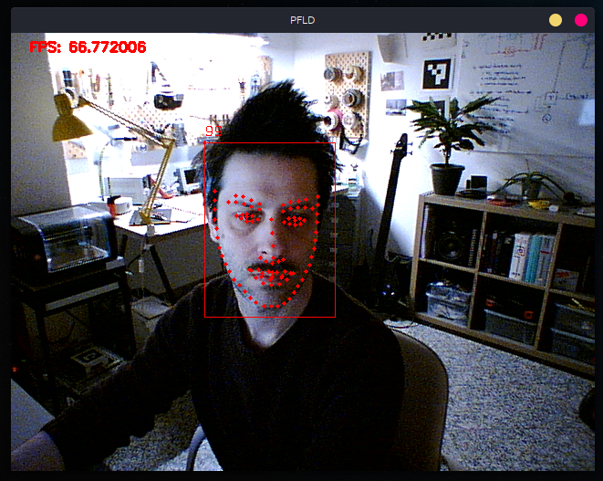

## PFLD-NCNN

C++ Implementation of Practical Facial Landmark Detector on NCNN.

### Model

The model has been converted from onnx to ncnn - original model implemented on pyTorch and trained on WFLW dataset by [Polaris Zhao](https://polariszhao.github.io/).

### Prerequisites

* The landmark detector currently relies on [libfacedetection](https://github.com/ShiqiYu/libfacedetection).
* Installed NCNN library. *( GPU and Vulkan support is autodetected during compilation. )*

### Build

```bash
mkdir build && cd build
cmake ..
make
```

### Result

Currently the binary will try to open the first video device it founds and tries to utilize a discrete GPU, if that fails will run on CPU *( using all threads )*.




### Reference

PFLD: A Practical Facial Landmark Detector https://arxiv.org/pdf/1902.10859.pdf